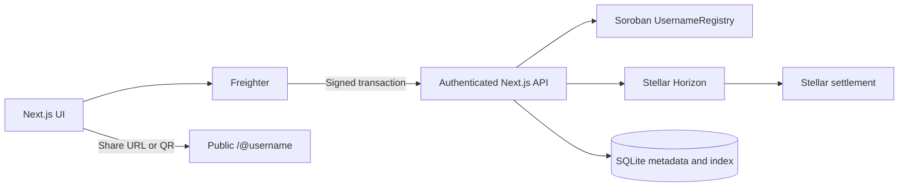
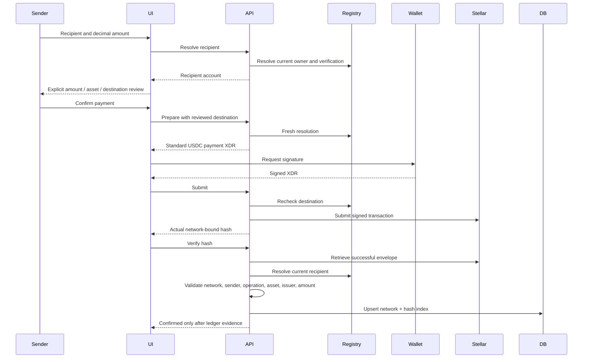
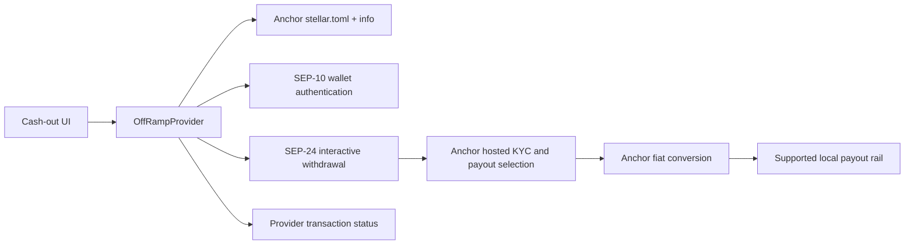

# Architecture

SkylarPay coordinates payment identity and UX. Funds move directly between user wallets. The contract owns username mappings; Stellar owns settlement evidence; an anchor owns fiat conversion and payout.

## Identity

`register(name,address)` requires address authorization. `resolve`, `owner_of`, and `exists` use canonical validated names. Ownership is persistent contract storage, extended during signed writes. Transfers use `propose_transfer`, `accept_transfer`, and `cancel_transfer`. Only the current owner can propose/cancel; only the proposed recipient can accept. The immutable deployment verifier can update address-based verification, but cannot mutate ownership. Verification reveals only a boolean; profile details remain off-chain.

`server/registry.ts` centralizes contract simulation, preparation, signed submission, network validation, resolution, and verification. Server-side verifier credentials never enter client code. The app refuses an unconfigured or mismatched contract.

## Authentication

The server stores a five-minute, random challenge transaction. The wallet signs it without submission. The server verifies the unchanged body and account signature against network-bound transaction hashing and account signing thresholds. It atomically consumes the challenge and issues a random HTTP-only, SameSite-strict session token; only its hash is stored. Private routes derive identity from the session, never a client `userId`. Origin checks protect mutations.

## Payment path

Amounts are strings and compared as BigInt units (10^7); no floating-point financial arithmetic. Unavailable evidence yields pending. Errors do not produce confirmed records. Private notes are account-scoped and absent from transaction memos. Displayed balance is a Horizon balance matched by asset code and issuer.

## Off-ramp

`Sep24Provider` discovers endpoints, validates the challenge with Stellar SDK WebAuth, submits the signed challenge, stores the anchor token server-side, and launches the provider’s hosted flow. An idempotency key is reserved before any external initiation. A repeated request cannot launch a second withdrawal. Provider status strings map to explicit application states; unknown states cause an error. When the provider returns complete transfer instructions, the funding boundary presents its destination, amount, issuer, network and memo for review, persists the prepared XDR, validates the wallet signature’s transaction body against it, reserves the exact hash, and submits only that transaction on retries. Stellar confirmation of that transfer does not imply fiat payout. Terminal statuses stop polling. UI polls every ten seconds, caps automatic attempts, and offers manual refresh.

`DemoOffRamp` exists only in Testnet development. It never transfers USDC, invents a rate, or reports bank completion. No provider configured in real mode means unavailable.

## Files and data

- `app/`: pages and API entry point.
- `components/`: wallet context and consumer flows.
- `lib/`: shared configuration types, amount validation, wallet interface, API/payment client.
- `server/`: session authorization, SQLite, network and contract adapters, ledger verification, off-ramp.
- `contracts/username-registry/`: Soroban source, tests, locked dependencies.
- `scripts/`: real deployment and signed Testnet integration.
- `tests/`: unit, signed-envelope boundary integration, UI, and browser checks.

SQLite is an indexed representation, not a custody/balance ledger. Persistence is local and suited to a single hackathon server. Production needs persistent storage, backup, rate limits, observability, and operational policies appropriate to its deployment.
