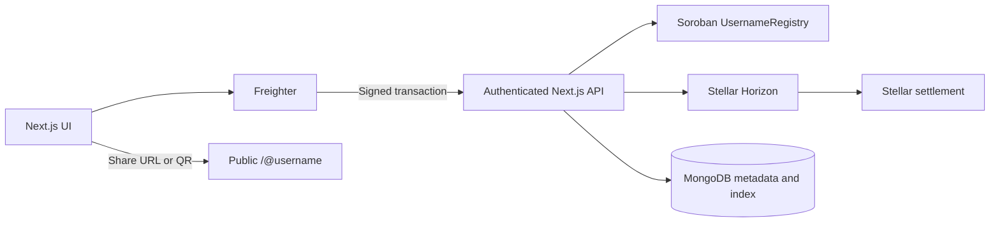
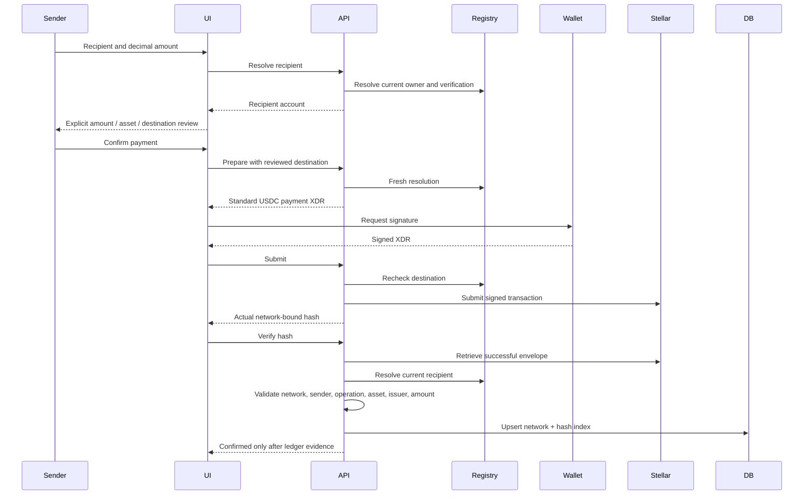
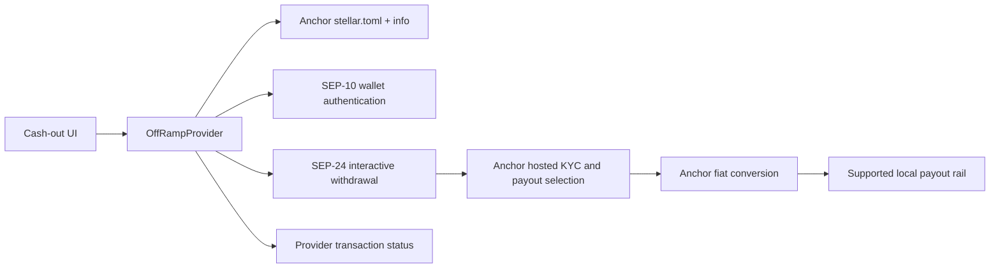

# Architecture

SylarPay coordinates payment identity and UX. Funds move directly between user wallets. The contract owns username mappings; Stellar owns settlement evidence; an anchor owns fiat conversion and payout.

## Identity

`register(name,address)` requires address authorization. `resolve`, `owner_of`, and `exists` use canonical validated names. Ownership is persistent contract storage, extended during signed writes. Transfers use `propose_transfer`, `accept_transfer`, and `cancel_transfer`. Only the current owner can propose/cancel; only the proposed recipient can accept. The immutable deployment verifier can update address-based verification, but cannot mutate ownership. Verification reveals only a boolean; profile details remain off-chain.

`server/registry.ts` centralizes contract simulation, preparation, signed submission, network validation, resolution, and verification. Server-side verifier credentials never enter client code. The app refuses an unconfigured or mismatched contract.

## Client state and API

Zustand owns wallet connection, signing progress and errors. Each provider creates its own store to avoid server-rendered state sharing. React Query owns configuration, account/profile data and withdrawal polling; private query keys include account and network. Changing accounts removes stale private caches. Axios applies request timeouts, credentials, cancellation and readable API errors. Money-moving API calls are never automatically retried. Freighter requests have bounded timeouts, so unavailable or unanswered extension requests release the Connect button.

## Account refresh

Successful payment submission/verification, private-note updates, trustline setup, registry/profile changes and anchor funding invalidate the connected account's network-scoped query through an Axios response interceptor. Active consumers refetch `/api/me`; no balances or confirmations are fabricated in the cache. Account data also refreshes on window focus and every 20 seconds while visible to detect incoming indexed payments. Background refetch retains the current UI instead of showing the initial skeleton again. Interceptors are removed on wallet/network changes and unmount.

## Authentication

The server stores a five-minute, random challenge transaction. The wallet signs it without submission. The server verifies the unchanged body and account signature against network-bound transaction hashing and account signing thresholds. It atomically consumes the challenge and issues a random HTTP-only, SameSite-strict session token; only its hash is stored. Private routes derive identity from the session, never a client `userId`. Origin checks protect mutations.

## Recipient discovery

`GET /api/recipients?query=sam` validates the normalized username prefix and returns at most eight matches. MongoDB public-profile usernames supply prefix candidates; the exact name is also queried directly. Every candidate is resolved against Soroban before returning its current address, verification and public profile. Missing names are omitted; registry outages produce an error. The input uses a 350 ms debounce and account/network-safe query state, hides stale results and provides selectable buttons. This discovery does not replace fresh exact resolution during review/preparation/submission.

## Payment path

Amounts are strings and compared as BigInt units (10^7); no floating-point financial arithmetic. Unavailable evidence yields pending. Errors do not produce confirmed records. Private notes are account-scoped and absent from transaction memos. Displayed balance is a Horizon balance matched by asset code and issuer.

## Multi-send

The authenticated `/api/multi-payments/prepare`, `/submit` and `/verify` routes accept 2–10 distinct username/amount/reviewed-address entries. Each stage performs fresh Soroban resolution. Preparation checks aggregate spendable USDC and each destination's authorized trustline/capacity, then constructs one transaction with ordered standard payment operations. The client rejects a wallet-modified transaction body and preserves its actual hash before submission.

Verification checks network, source, hash, success, exact operation count and each operation's source, destination, asset code, issuer and integer amount. No memo or extra operations are accepted. MongoDB stores a `PaymentBatch` with a unique network/hash index and immutable reviewed entries, leaving existing single-payment records intact. History projects one entry per operation: senders see all their entries, recipients see only their own. Private notes remain account-scoped and transaction-scoped. Response loss restores the same unresolved attempt without a second signature.

## Off-ramp

`Sep24Provider` discovers endpoints, validates the challenge with Stellar SDK WebAuth, submits the signed challenge, stores the anchor token server-side, and launches the provider’s hosted flow. Configured fiat is always intersected with SEP-38 where available, including when `ANCHOR_SIMULATED_FIAT=true`. Simulation labels the payout; it does not add unsupported currencies. The selected fiat is sent as `destination_asset`. An idempotency key is reserved before any external initiation. A repeated request cannot launch a second withdrawal. Provider status strings map to explicit application states; unknown states cause an error. When the provider returns complete transfer instructions, the funding boundary presents its destination, amount, issuer, network and memo for review, persists the prepared XDR, validates the wallet signature’s transaction body against it, reserves the exact hash, and submits only that transaction on retries. Stellar confirmation of that transfer does not imply fiat payout. Terminal statuses stop polling. UI polls every ten seconds, caps automatic attempts, and offers manual refresh.

`DemoOffRamp` exists only in Testnet development. It never transfers USDC, invents a rate, or reports bank completion. No provider configured in real mode means unavailable.

## Files and data

- `app/`: pages and API entry point.
- `components/`: Zustand wallet provider, React Query provider and consumer flows.
- `lib/`: shared configuration types, amount validation, wallet interface, API/payment client.
- `server/`: session authorization, Mongoose models, network and contract adapters, ledger verification, off-ramp.
- `contracts/username-registry/`: Soroban source, tests, locked dependencies.
- `scripts/`: real deployment and signed Testnet integration.
- `tests/`: unit, signed-envelope boundary integration, UI, and browser checks.

MongoDB is an indexed representation, not a custody/balance ledger. Mongoose awaits unique index creation before writes. Payment hashes are unique per network; withdrawal reservation keys are unique per account and network. Updates cannot downgrade a confirmed payment or terminal withdrawal. Authentication challenges are consumed atomically and expired auth records are TTL-cleaned. Production needs persistent storage, backup, rate limits, observability, and operational policies appropriate to its deployment.
